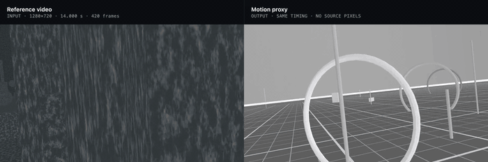
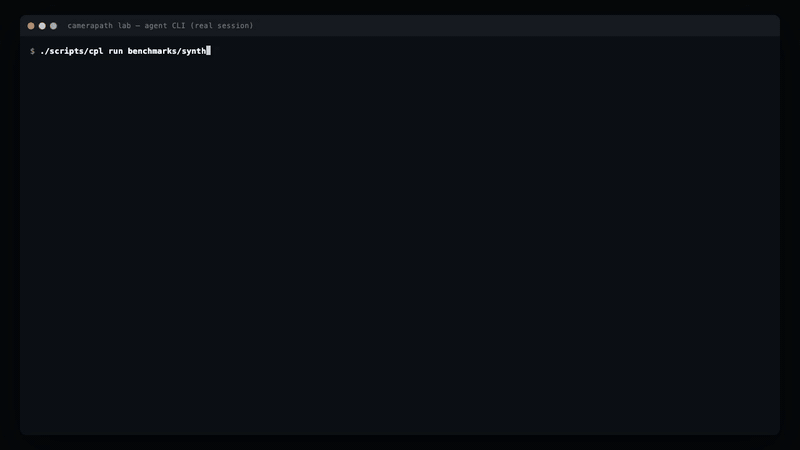

# CameraPath Lab

[](https://github.com/Kayariyan28/CameraPath-Lab/actions/workflows/ci.yml)
[](LICENSE)


**Recover the camera motion of a reference video and re-emit it as a clean 3D
motion reference.**

CameraPath Lab is a local macOS (Apple Silicon) app. You give it a video clip. It
reconstructs how the camera moved: trajectory, rotation, timing, speed and lens
(FOV/zoom). It also finds every hard cut. The output is a trajectory you can inspect
in 3D and an MP4 rendered by a Blender camera that carries exactly that motion
through neutral geometry. You can use that MP4 as a motion reference for
generative-video models such as Seedance.

The motion is kept and the content is dropped. No source pixels reach the exported
proxy.

> **Status: v0.1.0, early release.** The pipeline works end to end and is validated
> against synthetic ground truth. Some camera moves still fail or are weak. See
> [Known limitations](#known-limitations).

---

## Demo

A real session, recorded end to end: drop in a 14-second clip, analyse it, and generate
the motion reference. The long solve is time-lapsed and labelled; everything else runs
at normal speed.


*[Full-resolution recording (MP4, 43 s)](docs/media/camerapath-demo.mp4)*

The clip is three Blender shots joined by hard cuts — an FPV curve, an orbit and a
crane up. The app found both cuts at the exact frame and solved each shot on its own.

**Recovered camera trajectory** — shot 2, the orbit. Keyframe frustums along the path,
the live pose readout, per-frame kinematics, and the rendered proxy beside it:


**Analysis, before any 3D solve** — shots and cuts, measured image motion, and the
per-shot routing decision:


**Reference against proxy, playing together.** Watch the horizon and the ground plane:
the proxy carries the same roll, the same push and the same cut, frame for frame.



*[Full 14 s side-by-side (MP4)](docs/media/reference-vs-proxy.mp4) · [the proxy on its own, as delivered (MP4)](docs/media/motion-proxy-example.mp4) · [the same moments as stills](docs/images/reference-vs-proxy.png)*

The proxy reproduces the motion and the timing. It reproduces none of the content —
that is the point, since it is a motion reference, not a copy of the source.

## Features

- **Shot and cut detection.** Cuts are found with several cues: motion-compensated
  residuals, tracking collapse and histogram jumps. Each shot is solved on its own and
  the results are joined on the original timeline.
- **Camera solving through a fallback ladder.** Each method is tried in turn and the
  app says which one it used and why:
  - **COLMAP** structure-from-motion when parallax makes translation observable
  - long-baseline **keyframe homographies** for pans, tilts, rolls and zooms
  - screen-space **Perceptual Match** when feature matching fails
  - a labelled **2D motion proxy** as the last resort
- **Moving content is rejected.** People, cars and other moving objects are filtered
  out so they don't pull the camera solve.
- **Lens recovery.** Zoom is measured from K⁻¹HK and focal length is probed for
  observability. When the footage doesn't constrain focal length, the prior is
  labelled as a prior and never shown as a measurement.
- **Honest scale and confidence.** Translation is in *normalized* units unless you
  calibrate it. Confidence comes from evidence and can be LOW, with reasons given.
- **Exact timing.** Timestamps come from ffprobe PTS, and the output duration and frame
  count match the source.
- **Gravity-aligned world.** The world is oriented Z-up, and moves are classified as
  dolly, truck, pedestal, pan, tilt, roll, orbit, crane, and so on.
- **Web UI.** React and Three.js, with:
  - a 3D trajectory viewer
  - kinematics and motion curves
  - per-shot results and a solver audit log
- **Exports**
  - `trajectory.json` and `trajectory.csv` (per frame)
  - `analysis.json`
  - Nuke `.chan`
  - rendered motion-proxy MP4
- **Usable by AI agents.** An MCP server and a JSON CLI expose the same pipeline as
  tools, so an agent can hand over a video and get back the proxy MP4, the trajectory
  and a prompt-ready description of the camera move. See [docs/agents.md](docs/agents.md).

## How it works

```
video ──► ffprobe timing ──► shot detection ──► per-shot optical flow + dynamic rejection
                                                        │
                        wide-baseline parallax measurement
                                                        │
          ┌─────────────────────────────────────────────┼──────────────────────────┐
   translation observable                        no parallax                 matching fails
          │                                             │                          │
   COLMAP SfM (focal probed,              rotation from keyframe            Perceptual Match
   misregistrations rejected)             homographies, position fixed      (screen-space)
          └─────────────────────────────────────────────┼──────────────────────────┘
                                                        ▼
            fusion: SQUAD through anchors + per-frame residual (gain chosen by held-out anchors)
                                                        ▼
            gravity alignment ─► classification ─► exports ─► Blender headless render ─► MP4
```

Two ideas carry most of the accuracy:

1. **Absolute quantities come from long baselines, and detail comes from per-frame
   motion.** Per-frame estimates get the shape right but drift when accumulated. On a
   real 900-frame shot, accumulating them produced a 24% phantom zoom. Keyframe
   geometry fixes the totals, and optical flow fills in between.
2. **Held-out anchors decide how much per-frame detail to trust.** The app doesn't use
   a fixed rule for this.

The full design, hard invariants and coordinate conventions are in
[docs/architecture.md](docs/architecture.md).

## Accuracy

The synthetic benchmark is rendered in Blender with known ground truth: 19 scenes, 60
frames at 30 fps, and every frame scored. **18 of 19 scenes pass.**

| Move type | Solver | Rotation error |
|-----------|--------|---------------:|
| dolly, truck, pedestal, crane, orbit, FPV curve, accelerate/decelerate | COLMAP | 0.006° – 0.098° |
| pan, tilt, roll, static, zoom | keyframe rotation | 0.001° – 0.013° |
| handheld | COLMAP | 0.457° (27% speed error, weak) |
| hard cut (orbit → pan) | per shot | 0.449° / 0.007°, cut found at the exact frame |
| **dolly zoom** | Perceptual fallback | **fails** |

Trajectory shape error is ≤ 0.42% on the passing translation scenes, and timing is
exact on every scene. The real test clips are locked-off footage with people walking
through, so the true camera motion is zero. On them the app measured 0.14° and 0.36° of
phantom rotation over 15 s, no phantom zoom and no false cuts. The full table is in
[docs/architecture.md §13](docs/architecture.md#13-validation-results).

## Requirements

- macOS on Apple Silicon (developed on an M4)
- Python 3.11
- Node.js 18+
- FFmpeg (`brew install ffmpeg`)
- [Blender](https://www.blender.org/download/) 5.x (tested with 5.1). It is optional:
  without it, analysis and exports still work, but you can't render the MP4 proxy.

## Quick start

```bash
git clone https://github.com/Kayariyan28/CameraPath-Lab.git
cd CameraPath-Lab
./scripts/bootstrap_macos.sh     # create .venv, install Python + Node deps, check tools
./scripts/dev.sh                 # start backend (:8848) and frontend (:5173)
```

Open http://localhost:5173 and follow these steps:

1. Drop in a video.
2. Click **Analyse video** to detect shots and measure motion.
3. Click **Generate motion reference**. This solves the camera, writes the trajectory
   exports and renders the MP4 proxy.

Other useful commands:

```bash
.venv/bin/python scripts/doctor.py          # what works on this machine, and what doesn't
./scripts/bootstrap_macos.sh --check        # report only, change nothing
```

## Using the output with Seedance 2.5

This is what the project is for. A generative video model can be told *what* to show
in words, but camera movement is hard to describe and harder to repeat. The proxy
solves that by carrying the movement as a video: it holds the real camera path,
rotation and timing of your reference clip, and nothing else.

**1. Produce the proxy.** Either click **Generate motion reference** in the UI, or:

```bash
./scripts/cpl run your_clip.mp4 --wait --describe \
  --proxy-style ground_grid --match-source-aspect
```

`--match-source-aspect` matters for vertical footage — without it a 9:16 clip is
solved correctly but rendered into a 16:9 frame. The proxy always keeps the source's
frame count, fps and duration, so it lines up on a timeline with the original.

**2. Feed it as the reference clip.** Use the proxy wherever your tool accepts a video
to condition on — a video-to-video, reference-video or camera-motion input. Input
names differ between tools and releases, so check which one Seedance exposes for
motion conditioning; what matters from this side is that the file is a normal MP4
whose only content is the camera move.

**3. Describe the subject in the prompt, not the camera.** The proxy already carries
the camera. Spend the prompt on what the shot contains, and paste the app's own
summary for the movement — it is generated from the measured numbers, so it agrees
with the video you are supplying. For the demo clip above, the app produced:

> Shot 1 (0.0–5.0 s): Camera flies forward, banking through the turns (forward flight
> banking up to 13 deg), then tracks right (truck covering 28% of the path), then pans
> left (22 deg pan left). Hard cut. Shot 2 (5.0–10.0 s): Camera orbits around the
> subject (104 deg of yaw while travelling sideways about a centre). Hard cut.
> Shot 3 (10.0–14.0 s): Camera rises while tilting down (vertical travel with 18 deg
> of tilt).

Get that text from **Results** in the UI, `./scripts/cpl describe <job_id>`, or the
`describe_camera_motion` tool.

**One shot per generation.** A clip with hard cuts is solved as separate shots, each in
its own coordinate system, and the rendered proxy contains the cuts. Generative models
generally behave better on a single continuous move, so for a multi-shot source take
the per-shot proxies (`motion_proxy_shot_000.mp4`, …) and generate each shot separately.

**Which proxy style.** `ground_grid` is the best default: of the four styles it was the
only one whose motion a solver could read back out of the render with the path shape
intact (8% shape error, against 18–30% for the others, measured on a fast FPV shot). It
is also the least visually busy after `minimal`. `motion_cage` packs in the most
geometry, which is useful for eyeballing a path but noisier as a conditioning signal.

**What it will not do.** The proxy carries motion only — no style, subject, lighting or
content transfer, by design. It cannot rescue a bad solve either: if the app reports LOW
confidence, or says translation was not observable, the proxy faithfully reproduces a
rotation-only move and the generated result will match that, not the source's real
travel. Check the confidence before spending a generation on it.

## Use it from an agent

The same pipeline is available as tools, so an AI agent can produce a motion
reference without the UI:

```bash
./scripts/cpl run clip.mp4 --wait --describe    # JSON on stdout, progress on stderr
./scripts/cpl-mcp                               # MCP server over stdio
```

A real session — solve a clip, then ask for the description and the output paths:



*[Full recording (MP4)](docs/media/agent-cli-demo.mp4). Progress goes to stderr, so a
pipe gets nothing but the JSON document.*

Point any MCP client at the absolute path of `scripts/cpl-mcp`. The tools cover the
whole flow — start a recovery, poll it, read the measured motion, get a prompt-ready
description, and list the output files. Full reference, including the client config
block and how to read the results honestly: [docs/agents.md](docs/agents.md).

## What it will and will not claim

- Monocular video doesn't give absolute scale, so translation is **normalized** unless
  you calibrate a real-world reference. It is never labelled as metres by default.
- A pure pan, a pure zoom, distant scenery and near-zero parallax are *degenerate* for
  structure-from-motion. In those cases the app says translation is not observable and
  holds the position fixed. It doesn't invent a camera path.
- The recovered pose is the **optical camera** pose. For drone footage with a gimbal,
  that is not the aircraft body pose.
- A solver failure degrades to the next rung of the ladder and never crashes the job.

## Known limitations

- **Dolly zoom fails.** A zooming lens leaves COLMAP's image pairs uncalibrated, so it
  cannot initialise. The app reports LOW confidence and doesn't invent a path.
- **Handheld positional shake** is only partly reproduced, because it is finer than
  the anchor spacing. Rotational shake is kept.
- **Gravity** is estimated from camera orientations, so a steadily pitched shot with no
  yaw can be about 8° off.
- **Same-location cuts** with almost no histogram change can be missed.
- **FOV** falls back to a labelled 60° prior when the footage doesn't constrain focal
  length. You can set **FOV override** in the UI.
- **Not built yet:**
  - VGGT learned-geometry backend
  - third-person trajectory preview video
  - diagnostic overlays on the source video
  - solver comparison view
  - variable-frame-rate resampling

## Project layout

```
backend/     FastAPI service: video I/O, shot detection, tracking, solvers, fusion, exports
frontend/    React + TypeScript + Vite + Three.js UI
blender/     scripts run inside Blender's Python (proxy render, synthetic scenes)
scripts/     bootstrap, dev runner, doctor, test-clip and benchmark generators
tests/       unit tests (test clips are generated on first run)
benchmarks/  evaluation scripts; rendered data is generated locally, not committed
docs/        architecture, invariants, validation results
```

## Testing

```bash
.venv/bin/python -m pytest                  # unit suite; generates test clips on first run
./scripts/render_synthetic.sh               # render Blender ground-truth scenes
./benchmarks/run_dense_suite.sh             # score the solver against them
```

## License

[MIT](LICENSE) © 2026 Karan Chandra Dey
